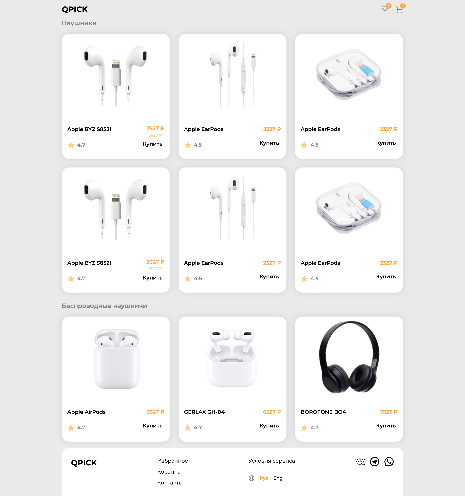
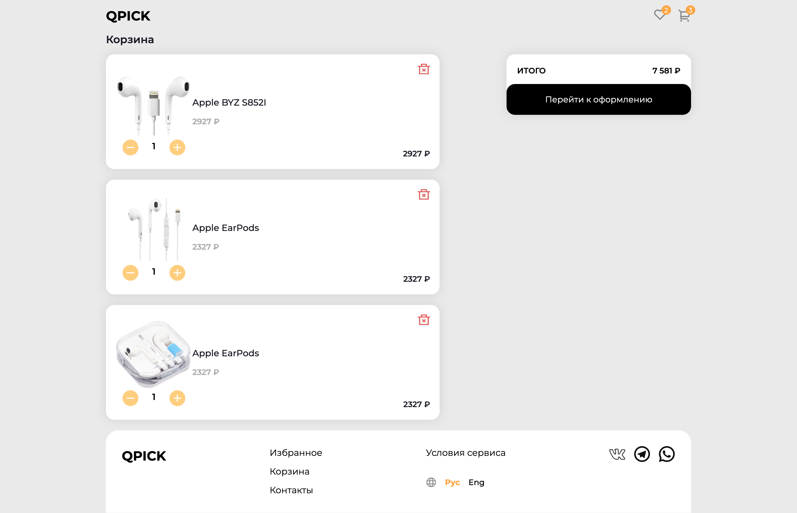
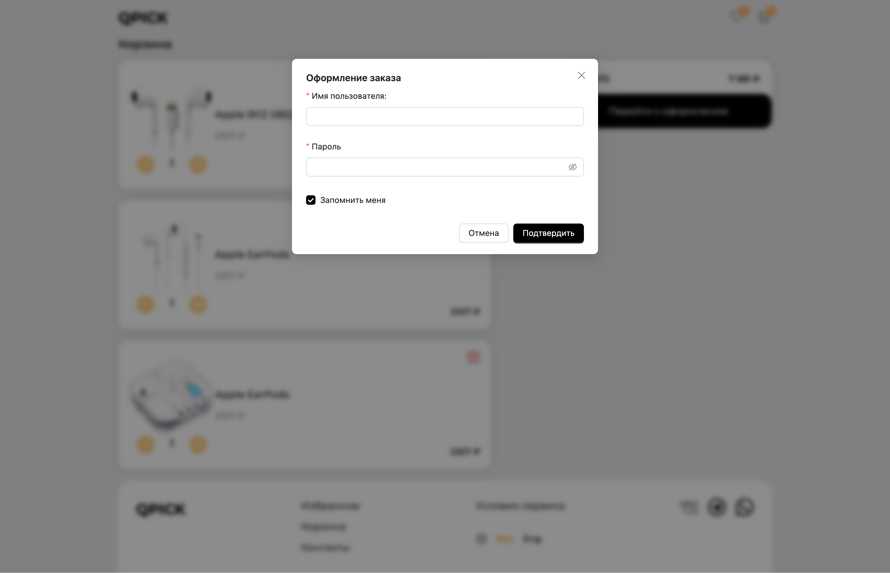

# QPICK

**Описание:**  
Тестовое задание для обучающего центра Neoflex, реализованное с использованием Tailwind CSS и современных веб-технологий.

---
## Скриншоты приложения

<div align="center">

### Десктопная версия
<div style="display: grid; grid-template-columns: repeat(2, 1fr); gap: 10px; margin: 20px 0;">
  
  
  
</div>
</div>

---

## Возможности

- **Работа с карточками товара** - Возможность добавления, удаления, редактирование количество товара.
- **Хранение данных** - Хранение данных session storage
- **Полная адаптивность** - Оптимизирован для всех устройств
- **Высокая производительность** - Быстрая загрузка и плавные анимации

---

## Установка и запуск

1. Клонируйте репозиторий:
   ```bash
   git clone https://github.com/TsoyIgorDev/qpick.git
   ```

2. Перейдите в папку проекта:
   ```bash
   cd qpick
   ```

3. Установите зависимости:
   ```bash
   npm install
   ```

4. Запустите проект в режиме разработки:
   ```bash
   npm run dev
   ```

5. Для сборки продакшн версии:
   ```bash
   npm run build
   ```

Приложение будет доступно по адресу: `http://localhost:5173`

---

## Технологии

- **Vite** - Современный сборщик проектов
- **React** - Библиотека для построения пользовательских интерфейсов
- **Tailwind CSS** - Утилитарный CSS-фреймворк
- **Ant Design** - Библиотека с компонентами для React

---

## Структура проекта

```
nike-tailwind/
├── public/
│   ├── screenshots/    # Скриншоты для документации
│   └── ...             # Статические файлы
├── src/
│   ├── components/     # React компоненты
│   ├── assets/         # Изображения
│   ├── constants/      # Константы
│   ├── sections/       # Секции лендинга
│   ├── hooks/          # Кастомные хуки
│   ├── context/        # Контексты
│   └── ...             # Исходный код
├── index.html          # Главный HTML файл
├── tailwind.config.js  # Конфигурация Tailwind
├── vite.config.js      # Конфигурация Vite
└── package.json        # Зависимости проекта
```

---
